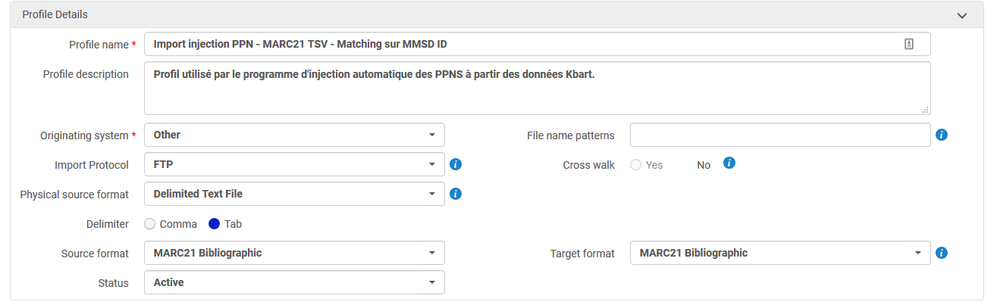
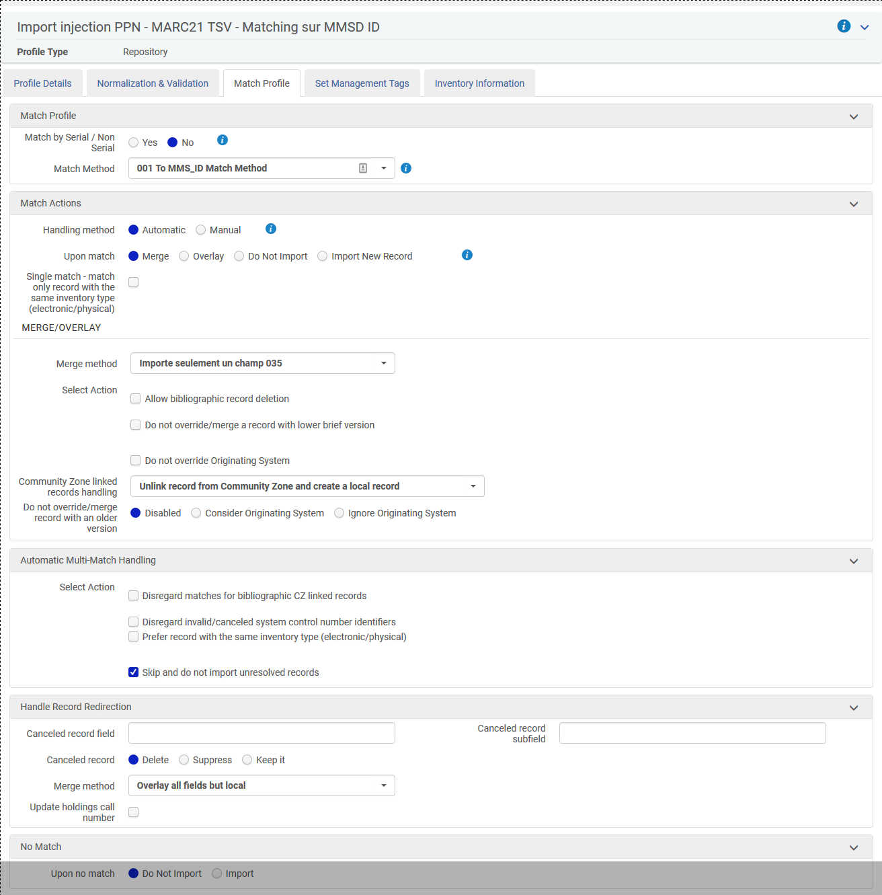

# Alma_Bacon_Analyse_Et_Synch
Injecte des PPN dans des notices de la CZ liées à des bouquets Bacon.
  - Prend en paramètre l'identifiant d'une collection électronique
  - Pour chaque bouquet, interroge le service Bacon id2Kbart avec tous les ISBN(s) ou ISSN(s) de la notice (e ou print) pour récupérer le PPN s'il existe
S'il y a PPN il créé une ligne dans un TSV avec le MMSID de la notice et le PPN
  - Dépose le fichier sur un FTP déclaré dans Alma
  - Déclenche un job de chargement qui copie la notice dans l'IZ et ajoute un PPN en 035.

## Pré-requis Alma
### Avoir configuré un ftp.

### Avoir configuré un profil de chargement 

### Paramètres
  - Identifiant de la colection électronique à traiter (Les bouquets doivent être activés dans l'institution)
  - Identifaint du job d'import [Working with the Alma Jobs API](https://developers.exlibrisgroup.com/blog/Working-with-the-Alma-Jobs-API/)
  - Clef d'API avec droits d'écriture dans les domaines Configuration and Administration et Electronic Resources
